# ARCHITECTURE.md — Composio Research Pipeline & Validation Architecture

## 1. System Pipeline Diagram

```mermaid
graph TD
    AppList[100 Target Enterprise SaaS Apps List] --> BatchRunner[research_agent.py: Batch Orchestrator]
    BatchRunner --> GeminiAPI[Google Gemini API: Structured Output Engine]
    
    GeminiAPI -->|Returns JSON Schema| PydanticValidation[Pydantic v2 Schema Validator]
    PydanticValidation -->|Valid| AppDataset[apps_research_v2.json]
    PydanticValidation -->|429 Rate Limit| BackoffRetry[Exponential Backoff Handler: 2^n sec]
    BackoffRetry --> GeminiAPI
    
    AppDataset --> ValidatorSuite[validator.py: HTTP Link Checker & Logic Suite]
    ValidatorSuite --> Report[validation_report.md]
    ValidatorSuite --> FixLinks[fix_links.py: Auto Link Corrector]
    
    AppDataset --> Dashboard[index.html: Interactive Research Matrix]
```



---

## 2. Pydantic Research Schema Model

```python
class AppResearchSchema(BaseModel):
    app_name: str
    category: str
    auth_types: List[str]  # e.g. ["Bearer Token", "OAuth 2.0", "API Key"]
    self_serve_access: bool  # Can developer generate keys instantly?
    free_tier_available: bool
    developer_doc_url: str
    mcp_buildability: str  # "Build-Ready", "Blocked", "Feasible"
    mcp_existing_tool: bool  # Is there an existing Composio tool or MCP server?
    notes: str
```

---

## 3. Findings Summary (100 Apps Sampled)
- **Build-Ready (Instant API Access)**: 82%
- **Blocked (Gated/Paid Only Access)**: 16%
- **Feasible (Manual Approval)**: 2%
- **Dominant Auth Types**: Bearer Token (67%), OAuth2 (56%), API Key (47%)
- **Composio / MCP Integration Exists**: 80%
